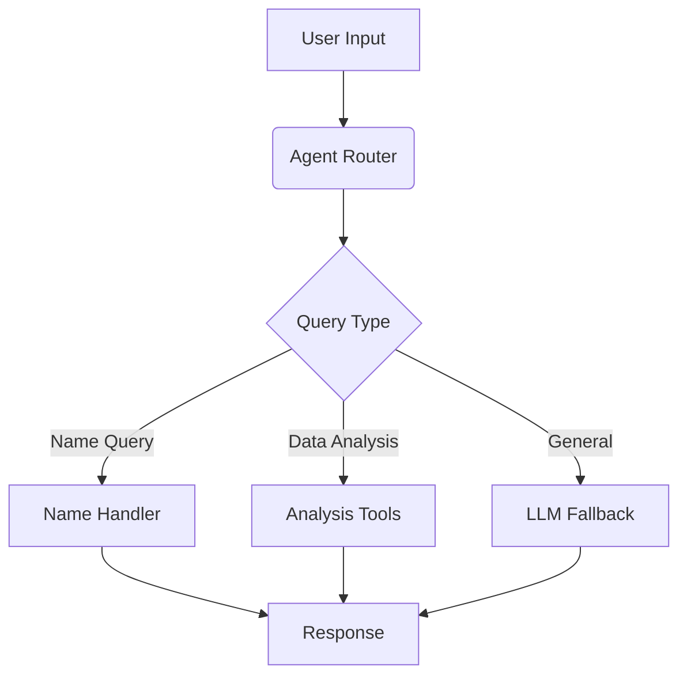

# LangChain Agents & Tools Project

A powerful chatbot system leveraging LangChain's agent framework with custom tools for data analysis and processing.

## Features

### Core Components
- **Agent System**: React-style agent with dynamic tool selection
- **Custom Tools**:
  - Data analysis (statistics, correlations)
  - File processing (CSV, Excel, JSON)
  - Name memory system
- **Error Handling**: Robust fallback mechanisms

### Technical Stack
- LangChain agents and tools
- FastAPI backend
- React frontend
- MongoDB for conversation history

## Getting Started

### Prerequisites
- Python 3.9+
- Node.js 16+
- MongoDB (optional)

### Installation
```bash
# Backend
cd backend
pip install -r requirements.txt

# Frontend
cd ../react-frontend
npm install
```

## Agent System Architecture



## Available Tools

| Tool Name | Description | Example Usage |
|-----------|-------------|---------------|
| Data Analysis | Descriptive statistics | "Show summary stats for this data" |
| Correlation Analysis | Finds relationships between columns | "What's the correlation between price and sales?" |
| Name Memory | Stores/recalls user names | "My name is John" |

## API Endpoints

- `POST /api/chat` - Main chat endpoint
- `POST /api/upload` - File upload endpoint
- `GET /api/chats` - Get conversation history

## Running the System

1. Start backend:
```bash
cd backend
uvicorn main:app --reload
```

2. Start frontend:
```bash
cd ../react-frontend
npm run dev
```

## Customizing Tools

To add a new tool:
1. Create a new class in `endpoints/tools.py`
2. Implement the required methods
3. Add to tools list in `llm_chain.py`

Example tool template:
```python
class CustomTool:
    name = "custom_tool"
    description = "Description of what the tool does"
    
    def __call__(self, input):
        # Implement your logic here
        return result
```

## Testing

Run the test suite:
```bash
pytest tests/
```

Test with sample data:
```bash
curl -X POST http://localhost:8000/api/chat \
  -H "Authorization: Bearer YOUR_TOKEN" \
  -d '{"prompt":"Analyze this data"}' \
  -F "file=@data.csv"
```

## Deployment

Docker setup available in `docker-compose.yml`:
```bash
docker-compose up --build
```

## Contributing

1. Fork the repository
2. Create feature branch
3. Submit pull request
